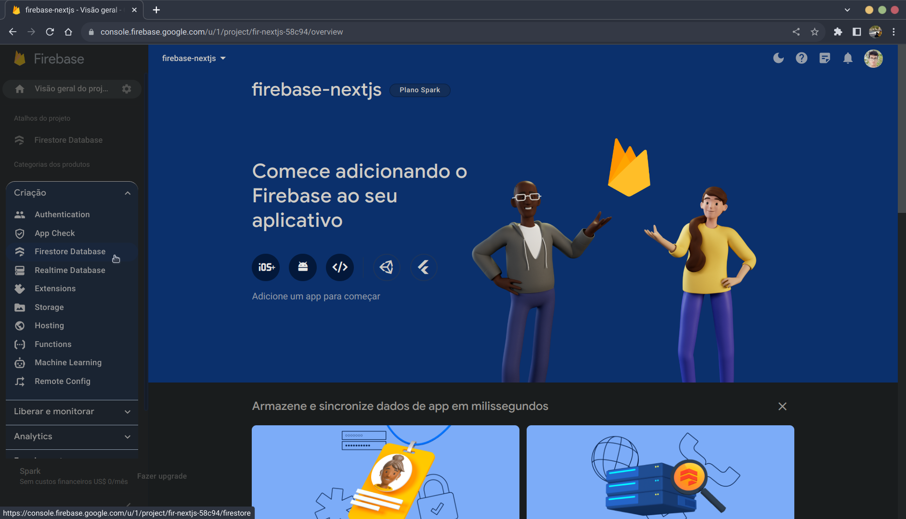
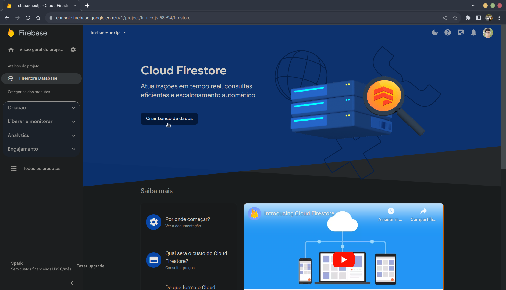
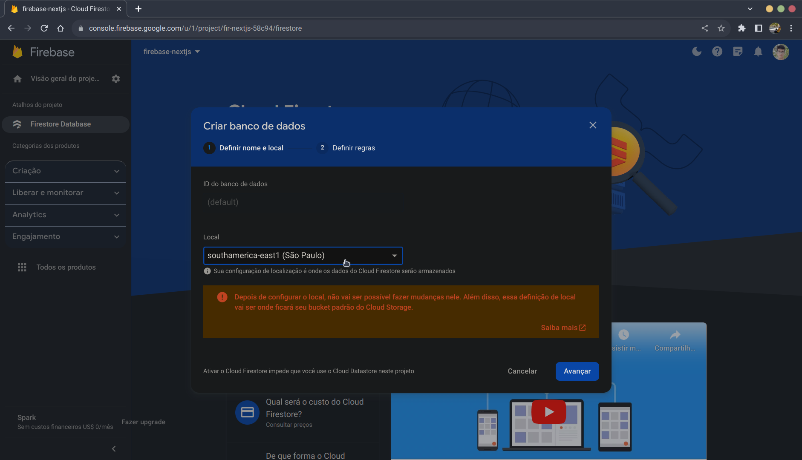
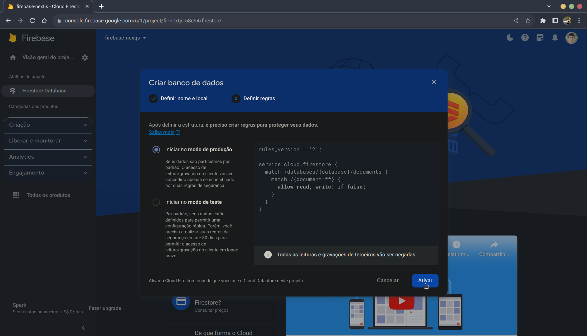

# Firestore

Obs.: Caso ainda não tenha criado o seu projeto no Firebase, siga o seguinte tutorial: [Criando um Projeto no Firebase](../../../firebase/README.md#criando-um-projeto-no-firebase), para criar o seu projeto.

## Criação do Firestore do Projeto

Na lateral esquerda verá uma opção chamada `Criação`, clique nela e depois em `Firestore Database`:

Agora em `Criar banco de dados`:

No campo `Local` da Pop-up escolha `southamerica-east1 (São Paulo)`:

Por fim em `Ativar` e agurde:

