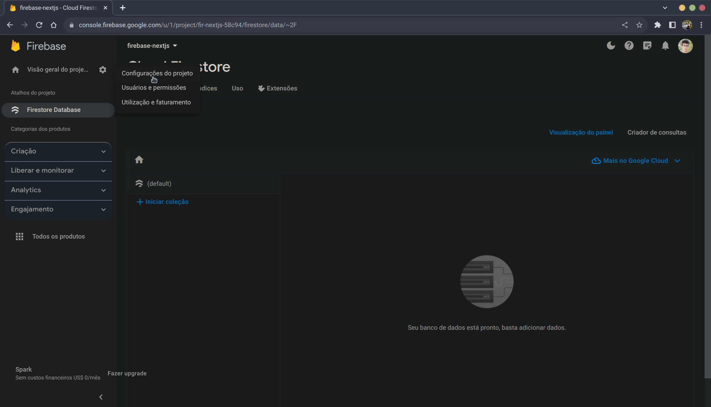
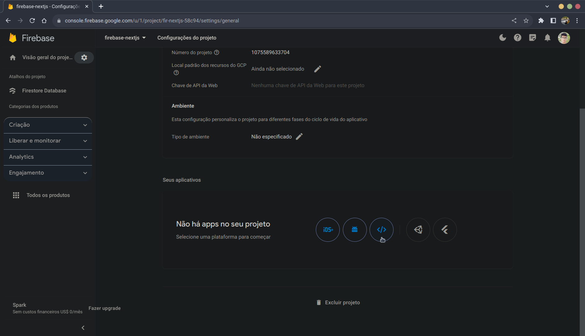
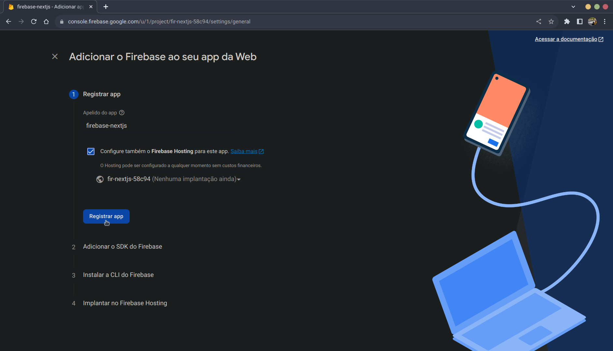
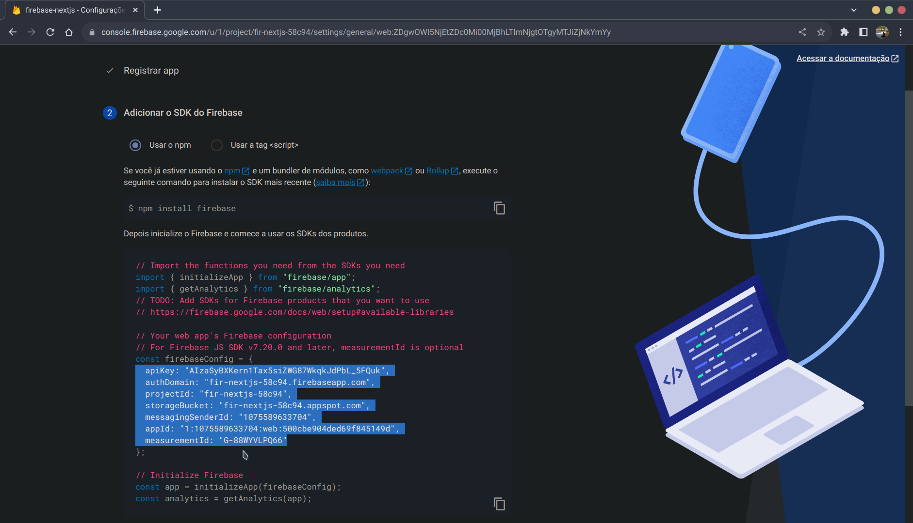
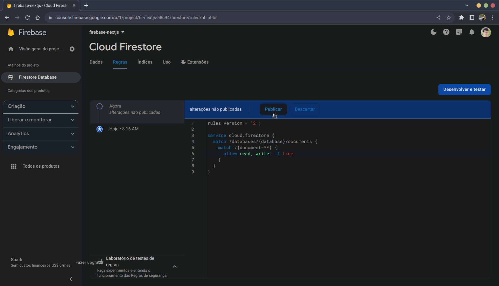

# Firestore no NextJS

## Instalação

No seu projeto NextJS, instale o `firebase`:

```bash
npm install firebase

ou

yarn add firebase

ou

pnpm add firebase
```

## Configuração

### Firebase

No console do projeto, clique na engrenagem que está na parte superior esquerda, logo depois de `Visão geral do projeto`, em seguida na opção `Configurações do projeto`:



Role para baixo e na seção `Seus aplicativos` clique no ícone `</>`:



Cologue o apelido do aplicativo em `Apelido do app` e aceite `Configure também o Firebase Hosting para este app.` caso queira.



No passo 2, copie o conteúdo da variável `firebaseConfig`:



Aperte em próximo, depois próximo e `Continuar no console`.

Na aba `regras`, abaixo do título `Cloud Firestore`, mude a regra da linha ` allow read, write: if false` de `false` para `true` e publique:



Obs.: Essa configuração é apenas para podermos interagir com o Firestore, mas para projetos reais crie regras seguras que atendam as necessidades do projeto.

### DotEnv

Abra o arquivo `.env` do seu projeto NextJS, cole o que copiou anteriormente da variável `firebaseConfig` e cologue as seguintes variáveis de ambiente:

```bash
NEXT_PUBLIC_API_KEY =
NEXT_PUBLIC_AUTH_DOMAIN =
NEXT_PUBLIC_PROJECT_ID =
NEXT_PUBLIC_STORAGE_BUCKET =
NEXT_PUBLIC_MESSAGING_SENDER_ID =
NEXT_PUBLIC_APP_ID =
NEXT_PUBLIC_MEASUREMENT_ID =
```

Agora passe cada dado para as suas respectivas variáveis de ambiente.

### Configuração do Firebase no NextJS

Dentro da pasta `src` crie uma nova pasta chamada `services` e dentro dela uma pasta com o nome `firebase`, com um arquivo `index.ts`.
Com o arquivo aberto cole o seguinte:

```typescript
/// src/services/firebase/index.ts

import { initializeApp } from "firebase/app";
import {
  addDoc,
  collection,
  deleteDoc,
  doc,
  getDoc,
  getDocs,
  getFirestore,
  query,
  setDoc,
  updateDoc,
  where,
} from "firebase/firestore";

const firebaseConfig = {
  apiKey: process.env.NEXT_PUBLIC_API_KEY,
  authDomain: process.env.NEXT_PUBLIC_AUTH_DOMAIN,
  projectId: process.env.NEXT_PUBLIC_PROJECT_ID,
  storageBucket: process.env.NEXT_PUBLIC_STORAGE_BUCKET,
  messagingSenderId: process.env.NEXT_PUBLIC_MESSAGING_SENDER_ID,
  appId: process.env.NEXT_PUBLIC_APP_ID,
  measurementId: process.env.NEXT_PUBLIC_MEASUREMENT_ID,
};

const app = initializeApp(firebaseConfig);
const db = getFirestore(app);

export {
  addDoc,
  collection,
  db,
  deleteDoc,
  doc,
  getDoc,
  getDocs,
  query,
  setDoc,
  updateDoc,
  where,
};
```

Obs.: Esse é um exemplo genérico do código de inicialização do firebase, fique a vontade para adicionar ou remover elementos conforme as necessidades do seu projeto.

Ao exportar a instância do banco de dados juntamente com os métodos do `firestore`, podemos ter apenas uma importação nos arquivos que irão usar o firebase, em vez de duas ou mais.

### Utilização do Firestore em um projeto NextJS

Antes de iniciar as leituras desse tópico, há algumas coisas que preciso salientar para que possa entender melhor o funcionamento do Firestore.
Para começar, os registros no Firestore são chamados de documentos, o equivalente as colunas em um banco de dados SQL.
Outro ponto é que o Firestore usa um banco de dados NoSQL, o que significa que não conseguirá criar um padrão de documentos no console do Firestore, tendo que lidar com a padronização dos documentos onde o Firestore estiver sendo usado.

Obs.:

- Nos exemplos dos códigos que verá, será utilizado um objeto do tipo `user`, que contém nome, idade e email, e os nomes das variáveis e funções estão em conformidade com o nome da coleção `users` onde esses documentos serão guardados. Contudo, adapte os códigos conforme as suas necessidades, os nomes utilizados são apenas para exemplificar o código.
- Todos os recursos usados do `Firestore` serão importados do arquivo `src/services/firebase/index.ts`.

</br>

Nos READMEs abaixo encontrá explicações de como adicionar, ler, atualizar e excluir documentos no seu banco de dados Firestore:

- [Criação de um Documento no Firestore em um Projeto NextJS](./add-document.md)
- [Obtenção de um Documento do Firestore em um Projeto NextJS](./get-document.md)
- [Obtenção de Documentos do Firestore em um Projeto NextJS](./get-documents.md)
- [Atualização de Documento do Firestore em um Projeto NextJS](./update-document.md)
- [Exclusão de Documento do Firestore em um Projeto NextJS](./delete-document.md)
