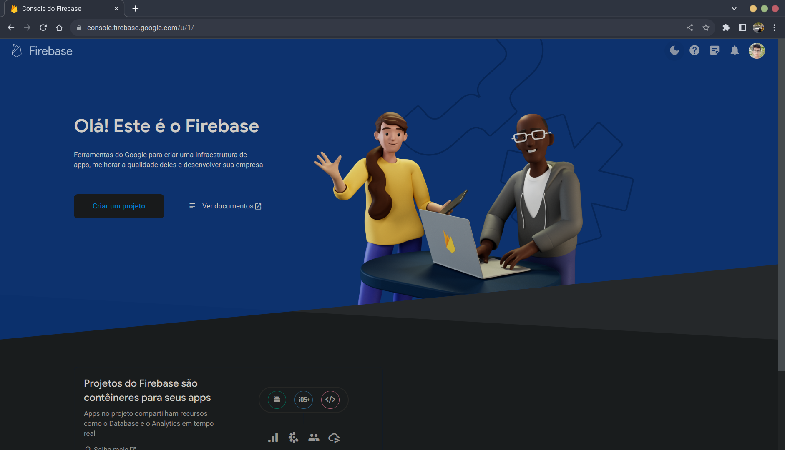
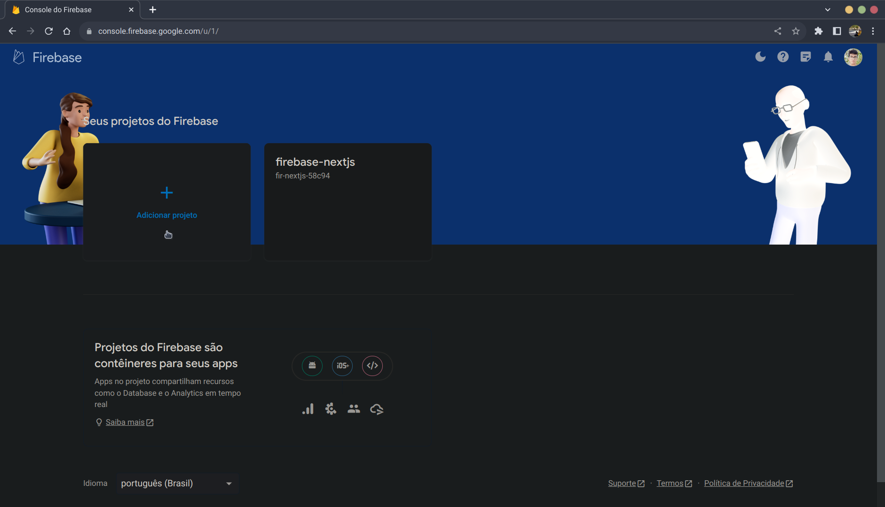
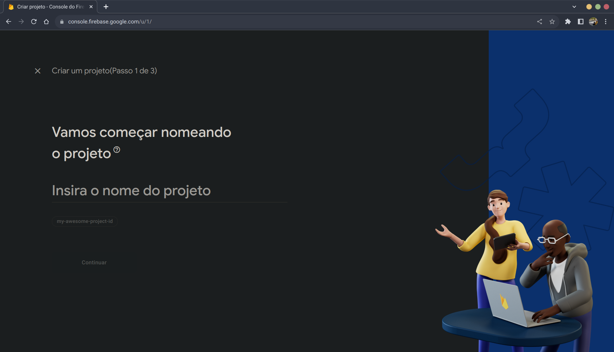
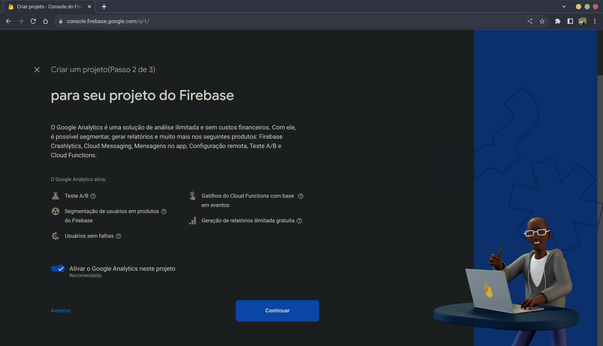
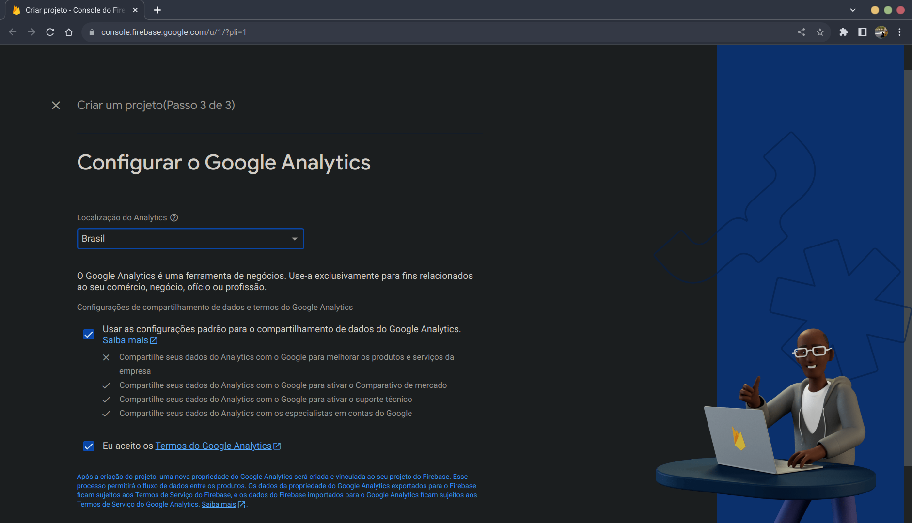
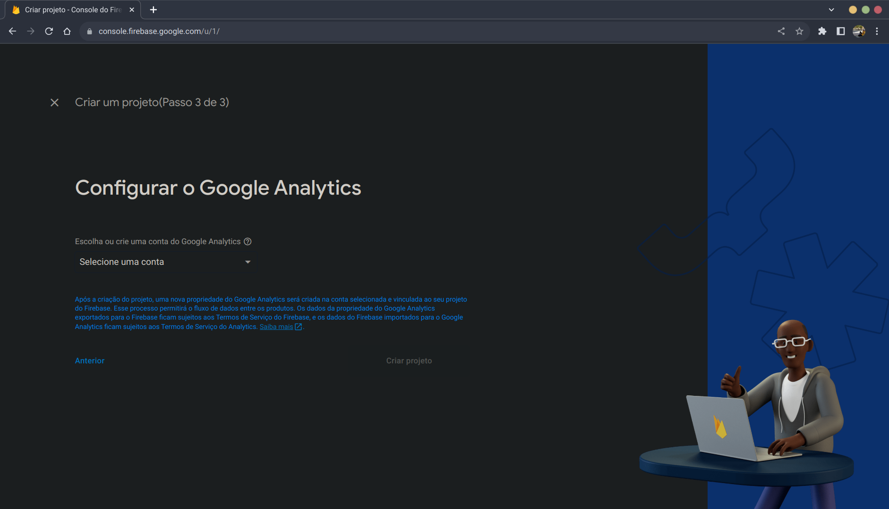

# Firebase

## Criação do Projeto no Firebase

Comece acessando o console do Firebase para criar o seu projeto: [Link](https://console.firebase.google.com/).

Se estiver criando um projeto pela primeira vez, a tela que irá aparacer será esta:

Agora clique em `Criar um projeto`.

Mas caso já tenha criado um projeto em outro momento, a tela mostrada será a seguinte:

Nessa tela clique em `Adicionar projeto`.

Com isso começará o processo de criação do projeto.

Na tela do passo 1 insira o nome do projeto no campo `Insira o nome do projeto` e aceite os termos de uso:

Para esse tutorial irei usar `firebase-nextjs` como nome do projeto.

Na tela seguinte aperte em `Continuar`:

 

No último passo cologue `Localização do Analytics` como `Brasil`, aceite todos os termos, aperte em `Criar projeto` e aguarde a criação do projeto:

Porém caso já tenha criado um projeto anteriormente, será a seguinte tela que será mostrada:

Porém basta selecionar `Default Account for Firebase` em `Escolha ou crie uma conta do Google Analytics`.
