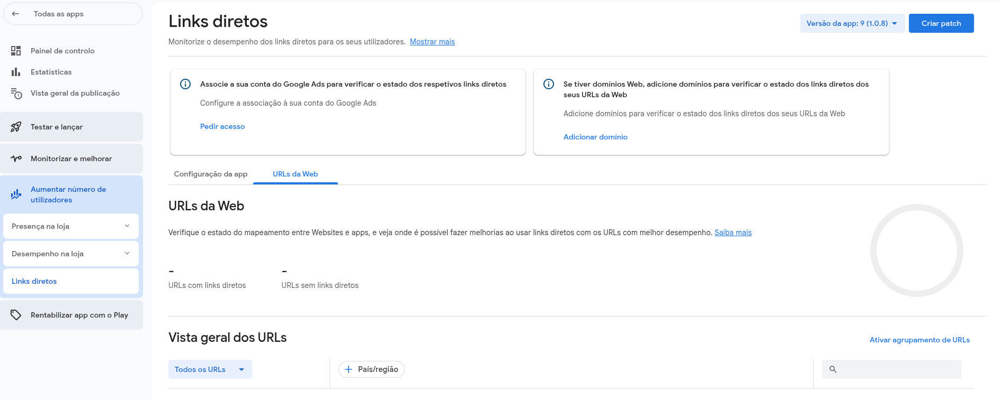
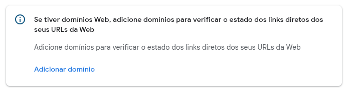
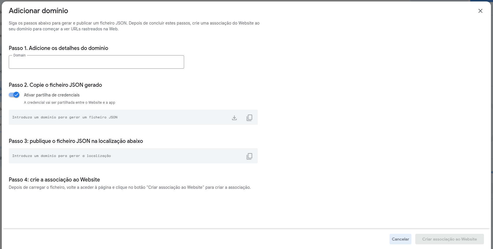
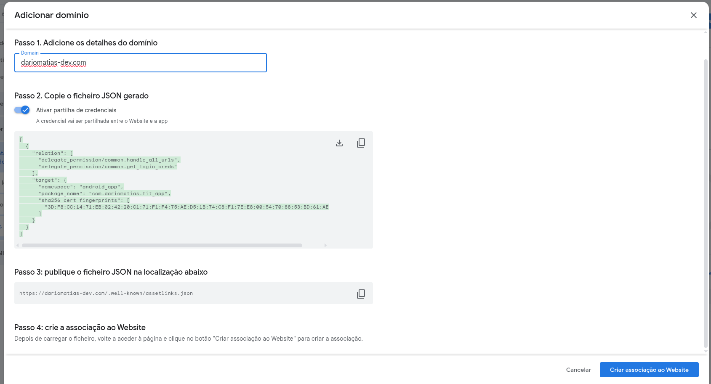

<br>
<div align="center">


</div>
<br>

<h1 align="center">Guia de Deep Links no Flutter</h1>

<p align="center">
Um guia completo para implementar App e Deep Links em sua aplicação Flutter para experiências de usuário contínuas.  
<br>
<a href="#sumário"><strong>Explore a documentação »</strong></a>

## Sumário

- [Sobre Deep Links](#sobre-deep-links)
  - [Documentação Oficial](#documentação-oficial)
- [Conceitos Chave](#conceitos-chave)
- [Desenvolvido Com](#desenvolvido-com)
- [Primeiros Passos](#primeiros-passos)
  - [Pré-requisitos](#pré-requisitos)
  - [Instalação](#instalação)
- [Guia de Implementação](#guia-de-implementação)
  - [Configuração da Aplicação Flutter](#configuração-da-aplicação-flutter)
  - [Configuração Android](#configuração-android)
  - [Testando Deep Links](#testando-deep-links)
- [Contribuindo](#contribuindo)
- [Autor](#autor)

## Sobre Deep Links

Deep links são URLs que direcionam os usuários para conteúdo ou recursos específicos dentro de um aplicativo móvel, em vez de apenas abrir o aplicativo em sua tela padrão ou uma página da web.

Quando um usuário clica em um deep link, o sistema operacional verifica se um aplicativo associado está instalado e, se estiver, abre o aplicativo que direciona para um conteúdo especificado. Se o aplicativo não estiver instalado, uma página web será aberta naquele endereço.

### Documentação Oficial

- App Links: [Documentation](https://developer.android.com/training/app-links/verify-android-applinks?hl=pt-br)
- Deep Links: [Documentation](https://developer.android.com/training/app-links/deep-linking?hl=pt-br)

## Conceitos Chave

- **Custom URI Schemes:** `myapp://product/123`. Fácil de configurar, menos seguro.
- **Android App Links:** URLs HTTP/HTTPS verificadas. Exigem domínio e arquivo `assetlinks.json`.
- **App Links e Universal Links:** oferecem segurança e fallback melhores que esquemas personalizados.

## Desenvolvido Com

- **[Flutter](https://flutter.dev/)** Kit de ferramentas de UI do Google para construir aplicativos bonitos e nativamente compilados.
- **[Dart](https://dart.dev/)** Linguagem usada para Flutter, otimizada para aplicativos rápidos.
- **[app_links](https://pub.dev/packages/app_links):** Pacote Flutter para gerenciar e ouvir deep links.

## Primeiros Passos

### Pré-requisitos

- Editor de código como VS Code ou Android Studio.
- Flutter SDK 3.x ou superior instalado e configurado.

### Instalação

Instale o pacote `app_links` no seu projeto:

```bash
flutter pub add app_links
```

## Guia de Implementação

### Configuração da Aplicação Flutter

Exemplo usando `app_links`:

```dart
import 'package:app_links/app_links.dart';
import 'package:flutter/material.dart';
import 'package:logger/logger.dart';

void main() async {
  runApp(MaterialApp(debugShowCheckedModeBanner: false, home: MyApp()));
}

class MyApp extends StatefulWidget {
  const MyApp({super.key});

  @override
  State<MyApp> createState() => _MyAppState();
}

class _MyAppState extends State<MyApp> {
  final _navigatorKey = GlobalKey<NavigatorState>();
  final _scaffoldMessengerKey = GlobalKey<ScaffoldMessengerState>();
  final _logger = Logger();

  DeepLinkService? _deepLinkService;

  @override
  void initState() {
    super.initState();

    WidgetsBinding.instance.addPostFrameCallback((timeStamp) {
      final handler = DeepLinkHandler(
        navigatorKey: _navigatorKey,
        scaffoldMessengerKey: _scaffoldMessengerKey,
      );

      _deepLinkService = DeepLinkService(
        handler: handler,
        logger: _logger,
        navigatorKey: _navigatorKey,
        scaffoldMessengerKey: _scaffoldMessengerKey,
      );

      _deepLinkService?.init();
    });
  }

  @override
  void dispose() {
    _logger.close();

    super.dispose();
  }

  @override
  Widget build(BuildContext context) {
    return MaterialApp(
      navigatorKey: _navigatorKey,
      scaffoldMessengerKey: _scaffoldMessengerKey,
      debugShowCheckedModeBanner: false,
      title: 'MyApp',
      routes: {
        '/': (context) => HomeScreen(),
        '/product': (context) => ProductScreen(),
      },
    );
  }
}

class DeepLinkService {
  final DeepLinkHandler _handler;
  final Logger logger;
  final GlobalKey<NavigatorState> navigatorKey;
  final GlobalKey<ScaffoldMessengerState> scaffoldMessengerKey;

  DeepLinkService({
    required DeepLinkHandler handler,
    required this.logger,
    required this.navigatorKey,
    required this.scaffoldMessengerKey,
  }) : _handler = handler;

  final _appLinks = AppLinks();

  void init() async {
    try {
      final initialLink = await _appLinks.getInitialLink();

      if (initialLink != null) {
        _handler.handle(initialLink);
      }

      _appLinks.uriLinkStream.listen(_handler.handle);
    } catch (err, stackTrace) {
      logger.e('Deep Link', error: err, stackTrace: stackTrace);
    }
  }
}

class DeepLinkHandler {
  final GlobalKey<NavigatorState> navigatorKey;
  final GlobalKey<ScaffoldMessengerState> scaffoldMessengerKey;

  DeepLinkHandler({
    required this.navigatorKey,
    required this.scaffoldMessengerKey,
  });

  void handle(Uri uri) {
    if (uri.pathSegments.isNotEmpty) {
      if (uri.pathSegments.first == 'product') {
        final productId = uri.pathSegments.length > 1
            ? uri.pathSegments[1]
            : '';

        navigatorKey.currentState?.push(
          MaterialPageRoute(
            builder: (context) {
              return ProductScreen(productId: productId);
            },
          ),
        );
      } else {
        scaffoldMessengerKey.currentState?.showSnackBar(
          SnackBar(content: Text('Invalid Link: ${uri.path}')),
        );
      }
    }
  }
}

class HomeScreen extends StatelessWidget {
  const HomeScreen({super.key});

  @override
  Widget build(BuildContext context) {
    return Scaffold(
      appBar: AppBar(title: Text('Home')),
      body: Center(child: Text('Main Screen')),
    );
  }
}

class ProductScreen extends StatelessWidget {
  const ProductScreen({super.key, this.productId = ''});

  final String productId;

  @override
  Widget build(BuildContext context) {
    return Scaffold(
      appBar: AppBar(title: Text('Product')),
      body: Center(child: Text('Product ID: $productId')),
    );
  }
}
```

### Configuração Android

1. **AndroidManifest.xml**:

No arquivo `AndroidManifest.xml` localizado em `android/app/src/main/AndroidManifest.xml`, adicione o seguinte código dentro da tag `activity`:

```xml
<!-- App Link to https://<webdomain>.com -->
<intent-filter android:autoVerify="true">
    <action android:name="android.intent.action.VIEW" />
    <category android:name="android.intent.category.DEFAULT" />
    <category android:name="android.intent.category.BROWSABLE" />
    <data
        android:scheme="https"
        android:host="<webdomain>.com"
        android:pathPrefix="/" />
</intent-filter>

<!-- Deep Link to https://<webdomain>.com -->
<intent-filter>
    <action android:name="android.intent.action.VIEW" />
    <category android:name="android.intent.category.DEFAULT" />
    <category android:name="android.intent.category.BROWSABLE" />
    <data
        android:scheme="domain"
        android:host="open.app" />
</intent-filter>
```

2. **assetlinks.json**:

Acesse o seu aplicativo no Play Console, abra `Aumentar número de utilizadores` e clique em `Links diretos`:



Clique na opção de `Adicionar domínio`:



No campo `Passo 1. Adicione os detalhes do domínio`, adicione o nome do domínio do seu aplicativo:



Depois copie o json gerado:



Que será algo como:

```json
[
  {
    "relation": [
      "delegate_permission/common.handle_all_urls",
      "delegate_permission/common.get_login_creds"
    ],
    "target": {
      "namespace": "android_app",
      "package_name": "com.yourcompany.yourapp",
      "sha256_cert_fingerprints": ["YOUR_SHA256_CERT_FINGERPRINT_1"]
    }
  }
]
```

Após copiar o arquivo JSON, ele deve ser adicionado no caminho `/.well-known/assetlinks.json` do domínio configurado, de forma que esteja acessível através da URL:
`https://dominio.com/.well-known/assetlinks.json`.

No caso de projetos desenvolvidos com React ou Next.js, basta criar a pasta `.well-known` dentro do diretório `public` e adicionar o arquivo `assetlinks.json` nela com o JSON gerado.

### Testando Deep Links

#### Comandos ADB

```bash
adb shell am start -a android.intent.action.VIEW -d "myscheme://<webdomain>.com/product/abc"
```

ou

```bash
adb shell am start -a android.intent.action.VIEW -d "https://<webdomain>.com" com.yourcompany.yourapp
```

#### Observações

Mesmo construindo o app com:

```bash
flutter build apk --release
```

O deep link só abrirá diretamente o aplicativo se ele tiver sido instalado pela Google Play Store. Caso contrário, o link será aberto no navegador.

Para permitir que o aplicativo abra links do domínio configurado, ative a opção nas configurações do Android:

```
Configurações do Android > Aplicativos > <Seu Aplicativo> > Abrir links suportados > Abrir no aplicativo
```

## Contribuindo

Contribuições são essenciais para o desenvolvimento da comunidade open-source e para o aprimoramento contínuo dos projetos.

Para começar:

1. **Faça um Fork do Projeto**

2. **Crie sua Branch de Funcionalidade**

   ```sh
   git checkout -b feature/new-feature
   ```

3. **Faça o Commit das Suas Alterações**

   ```sh
   git commit -m "Add new feature"
   ```

4. **Envie para a Branch**

   ```sh
   git push origin feature/new-feature
   ```

5. **Abra um Pull Request**

## Autor

Desenvolvido por **Dário Matias**:

- **Portfólio**: [dariomatias-dev](https://dariomatias-dev.com)
- **GitHub**: [dariomatias-dev](https://github.com/dariomatias-dev)
- **Email**: [matiasdario75@gmail.com](mailto:matiasdario75@gmail.com)
- **Instagram**: [@dariomatias_dev](https://instagram.com/dariomatias_dev)
- **LinkedIn**: [linkedin.com/in/dariomatias-dev](https://linkedin.com/in/dariomatias-dev)
